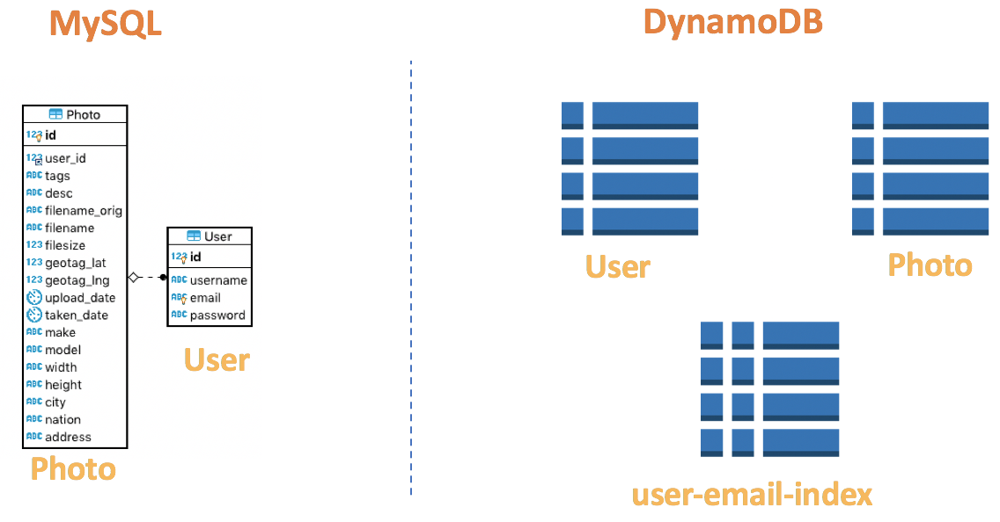
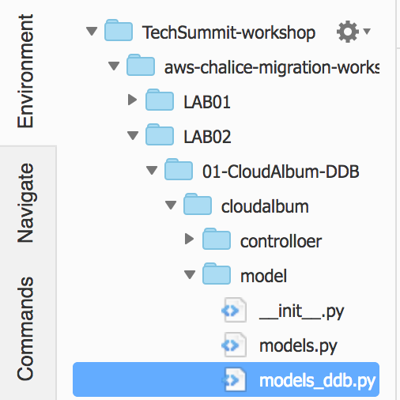
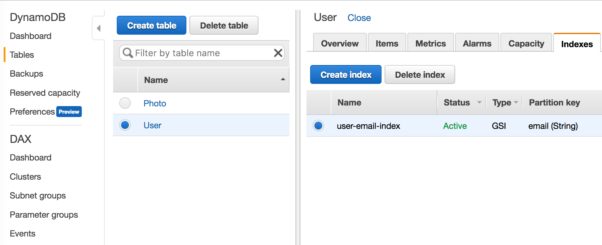
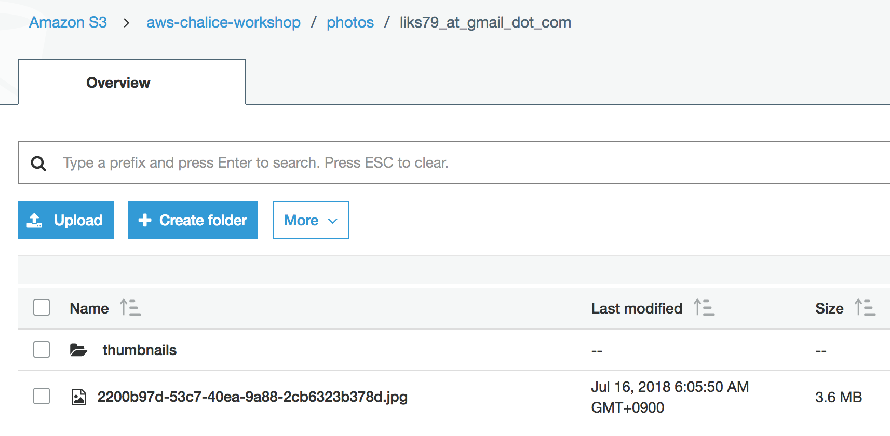
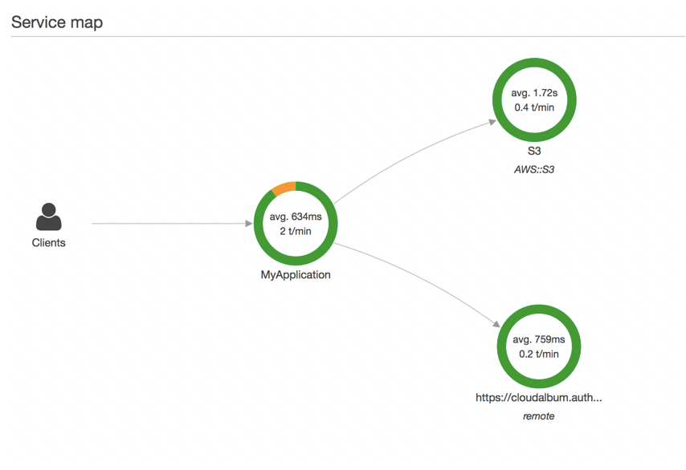

# LAB 02 - Move to serverless
We will move the components of legacy application which has constraints of scalability and high availability to serverless environment one by one.

## TASK 1. Go to DynamoDB
Amazon [DynamoDB](https://aws.amazon.com/dynamodb/) is a nonrelational database that delivers reliable performance at any scale. It's a fully managed, multi-region, multi-master database that provides consistent single-digit millisecond latency, and offers built-in security, backup and restore, and in-memory caching.

In this TASK, we will introduce DynamoDB for CloudAlbum application. We also introduce pynamodb which is a Pythonic interface to Amazon’s DynamoDB. By using simple, yet powerful abstractions over the DynamoDB API. It is similar to SQLAlchemy.


* Leagacy application uses RDBMS(MySQL), we will replace it to DynamoDB. DynamoDB is fully managed service.It means that automatically scales throughput up or down, and continuously backs up your data for protection.


* Legacy application uses **SQLAlchemy** for OR-Mapping. SQLAlchemy is the Python SQL toolkit and Object Relational Mapper that gives application developers the full power and flexibility of SQL.
  * visit : https://www.sqlalchemy.org/

* We will use **PynamoDB** instead of **SQLAlchemy** for OR-Mapping of DynamoDB. It is similar with SQLAlchemy. PynamoDB is a Pythonic interface to Amazon’s DynamoDB. By using simple, yet powerful abstractions over the DynamoDB API, PynamoDB allows you to start developing immediately.
  * visit : https://github.com/pynamodb/PynamoDB

* Legacy application has simple data model and we can design DynamoDB table easily.
  

1. Open the **models.py** which located in  'LAB02/01-CloudAlbum-DDB/cloudalbum/model/models.py'.

2. Review the data model definition via **SQLAlchemy**.
```python
from sqlalchemy import Float, DateTime, ForeignKey, Integer, String
from flask_login import UserMixin
from flask_sqlalchemy import SQLAlchemy
from cloudalbum import login

db = SQLAlchemy()


class User(UserMixin, db.Model):
    """
    Database Model class for User table
    """
    __tablename__ = 'User'

    id = db.Column(Integer, primary_key=True)
    username = db.Column(String(50), unique=False)
    email = db.Column(String(50), unique=True)
    password = db.Column(String(100), unique=False)

    photos = db.relationship('Photo',
                             backref='user',
                             cascade='all, delete, delete-orphan')

    def __init__(self, name, email, password):
        self.username = name
        self.email = email
        self.password = password

    def __repr__(self):
        return '<%r %r %r>' % (self.__tablename__, self.username, self.email)


class Photo(db.Model):
    """
    Database Model class for Photo table
    """
    __tablename__ = 'Photo'

    id = db.Column(Integer, primary_key=True)
    user_id = db.Column(Integer, ForeignKey(User.id))
    tags = db.Column(String(400), unique=False)
    desc = db.Column(String(400), unique=False)
    filename_orig = db.Column(String(400), unique=False)
    filename = db.Column(String(400), unique=False)
    filesize = db.Column(Integer, unique=False)
    geotag_lat = db.Column(Float, unique=False)
    geotag_lng = db.Column(Float, unique=False)
    upload_date = db.Column(DateTime, unique=False)
    taken_date = db.Column(DateTime, unique=False)
    make = db.Column(String(400), unique=False)
    model = db.Column(String(400), unique=False)
    width = db.Column(String(400), unique=False)
    height = db.Column(String(400), unique=False)
    city = db.Column(String(400), unique=False)
    nation = db.Column(String(400), unique=False)
    address = db.Column(String(400), unique=False)

    def __init__(self, user_id, tags, desc, filename_orig, filename, filesize, geotag_lat, geotag_lng, upload_date,
                 taken_date, make, model, width, height, city, nation, address):
        """Initialize"""

        self.user_id = user_id
        self.tags = tags
        self.desc = desc
        self.filename_orig = filename_orig
        self.filename = filename
        self.filesize = filesize
        self.geotag_lat = geotag_lat
        self.geotag_lng = geotag_lng
        self.upload_date = upload_date
        self.taken_date = taken_date
        self.make = make
        self.model = model
        self.width = width
        self.height = height
        self.city = city
        self.nation = nation
        self.address = address

    def __repr__(self):
        """print information"""

        return '<%r %r %r>' % (self.__tablename__, self.user_id, self.upload_date)
```

3. Open the **models_ddb.py** which located in  'LAB02/01-CloudAlbum-DDB/cloudalbum/model/models_ddb.py'.



4. Review the data model definition via **PynamoDB**.
```python
from pynamodb.models import Model
from pynamodb.attributes import UnicodeAttribute, NumberAttribute, UTCDateTimeAttribute
from flask_login import UserMixin
from pynamodb.indexes import GlobalSecondaryIndex, IncludeProjection
from cloudalbum import login
from cloudalbum import util
from cloudalbum.config import conf


class EmailIndex(GlobalSecondaryIndex):
    """
    This class represents a global secondary index
    """

    class Meta:
        index_name = 'user-email-index'
        read_capacity_units = 2
        write_capacity_units = 1
        projection = IncludeProjection(['password'])

    # This attribute is the hash key for the index
    # Note that this attribute must also exist
    # in the model
    email = UnicodeAttribute(hash_key=True)


class User(Model, UserMixin):
    """
    User table for DynamoDB
    """

    class Meta:
        table_name = 'User'
        region = conf['AWS_REGION']

    id = UnicodeAttribute(hash_key=True)
    email_index = EmailIndex()
    email = UnicodeAttribute(null=False)
    username = UnicodeAttribute(null=False)
    password = UnicodeAttribute(null=False)


class Photo(Model):
    """
    User table for DynamoDB
    """

    class Meta:
        table_name = 'Photo'
        region = conf['AWS_REGION']

    user_id = UnicodeAttribute(hash_key=True)
    id = NumberAttribute(range_key=True)
    tags = UnicodeAttribute(null=False)
    desc = UnicodeAttribute(null=False)
    filename_orig = UnicodeAttribute(null=False)
    filename = UnicodeAttribute(null=False)
    filesize = NumberAttribute(null=False)
    geotag_lat = UnicodeAttribute(null=False)
    geotag_lng = UnicodeAttribute(null=False)
    upload_date = UTCDateTimeAttribute(default=util.the_time_now())
    taken_date = UTCDateTimeAttribute(default=util.the_time_now())
    make = UnicodeAttribute(null=True)
    model = UnicodeAttribute(null=True)
    width = UnicodeAttribute(null=False)
    height = UnicodeAttribute(null=False)
    city = UnicodeAttribute(null=True)
    nation = UnicodeAttribute(null=False)
    address = UnicodeAttribute(null=False)
```

5. Review the '__init__.py' in the model package. The DynamoDB table 'User' and 'Photo' will be created automatically for the convenience. 

```python
from cloudalbum.config import conf
from cloudalbum.model.models_ddb import User
from cloudalbum.model.models_ddb import Photo

if not User.exists():
    User.create_table(read_capacity_units=conf['DDB_RCU'], write_capacity_units=conf['DDB_WCU'], wait=True)
    print('DynamoDB User table created!')

if not Photo.exists():
    Photo.create_table(read_capacity_units=conf['DDB_RCU'], write_capacity_units=conf['DDB_WCU'], wait=True)
    print('DynamoDB Photo table created!')
```

6. Review the 'LAB02/01-CloudAlbum-DDB/cloudalbum/config.py' file. Additional attributes are added for DynamoDB.
```python
import os

conf = {
   
    ( ... )
    
    # DynamoDB
    'AWS_REGION': os.getenv('AWS_REGION', 'ap-southeast-1'),
    'DDB_RCU': os.getenv('DDB_RCU', 10),
    'DDB_WCU': os.getenv('DDB_WCU', 10),

}
```
* The second parameter of **os.getenv** function is the default value to use when the first parameter does not exist.

7. Write your code for user signup.
* find **TODO #1** in the 'LAB02/01-CloudAlbum-DDB/cloudalbum/controlloer/user/userView.py' file.
```python
if not user_exist:
    ## TODO #1 : Write your code to save user information
```
* solution:

```python
user = User(uuid.uuid4().hex)
user.email = form.email.data
user.password = generate_password_hash(form.password.data)
user.username = form.username.data
user.save()
```

**NOTE**: The partition key value of User table used **uuid.uuid4().hex** for the appropriate key distribution.

8. Write your code to search result via keyword in the DynamoDB.
* find **TODO #2** in the 'LAB02/01-CloudAlbum-DDB/cloudalbum/controlloer/photo/photoView.py' file.
```python
## TODO #2 : Write your code to search result via keyword in the DynamoDB.
```

* solution:
```python
keyword = request.form['search']
photo_pages = Photo.query(current_user.id, Photo.tags.contains(keyword) | Photo.desc.contains(keyword))
```

9. Write your code to update user profile to DynamoDB.
* find **TODO #3** in the 'LAB02/01-CloudAlbum-DDB/cloudalbum/controlloer/user/userView.py' file.
```python
## TODO #3 : Write your code to update user profile to DynamoDB.
```

* solution:
```python
user = User.get(user_id)
user.update(actions=[
    User.username.set(data['username']),
    User.password.set(generate_password_hash(data['password']))
])
```

10. Write your code to delete uploaded photo information in DynamoDB.
* find **TODO #4** in the 'LAB02/01-CloudAlbum-DDB/cloudalbum/controlloer/photo/photoView.py' file.
```python
## TODO #4 : Write your code to delete uploaded photo information in DynamoDB.
```

* solution : 
```python
photo = Photo.get(current_user.id, photo_id)
photo.delete()
```


11. Run CloudAlbum application with DynamoDB.
* Ensure **Runner: Python 3**


12. Connect to http://localhost:8000 in your browser. (After SSH tunnel established.)

* You need to **Sign-up** first.

13. Perform application test.


* Sign in / up
* Upload Sample Photos
* Sample images download here 
  *  https://d2r3btx883i63b.cloudfront.net/temp/sample-photo.zip
* Look your Album
* Change Profile
* Find photos with Search tool
* Check the Photo Map

14. Then look into AWS DynamoDB console.
* User and Photo tables are auto generated with 'user-email-index'
* Review saved data of each DynamoDB tables.



Is it OK? Let's move to the next TASK.

## TASK 2. Go to S3
CloudAlbum stored user uploaded images into disk based storage. (EBS or NAS). However these storage is not scalable enough. 

[Amazon S3](https://aws.amazon.com/s3/) has a simple web services interface that you can use to store and retrieve any amount of data, at any time, from anywhere on the web. It gives any developer access to the same highly scalable, reliable, fast, inexpensive data storage infrastructure that Amazon uses to run its own global network of web sites. The service aims to maximize benefits of scale and to pass those benefits on to developers.


* We will use Boto3 - S3 API to handle uploaded photo image object from the user.
   * visit: https://boto3.readthedocs.io/en/latest/reference/services/s3.html 

* We will retrieve image object with pre-signed URL for authorized user.

15. Make a bucket to save photo image objects and retriev it from Amazon S3. 

```
aws s3 mb cloudalbum-<your name initial>
```

16. Review the config.py file which located in 'LAB02/02-CloudAlbum-S3/cloudalbum/config.py'

```python
import os

conf = {

    (....)

    # S3
    'S3_PHOTO_BUCKET': os.getenv('S3_PHOTO_BUCKET', 'aws-chalice-workshop')
}
```

* Make sure the value of 'S3_PHOTO_BUCKET'. Please change the 'aws-chalice-workshop' to 'cloudalbum-<your name initial>' which made above.


17. Write your code to save thumbnail image object to S3.
* find **TODO #5** in the 'LAB02/02-CloudAlbum-S3/cloudalbum/util.py' file.
```python
## TODO #5 : Write your code to save thumbnail image object to S3
```

* solution:
```python
upload_file_stream.stream.seek(0)

s3_client.put_object(
        Bucket=conf['S3_PHOTO_BUCKET'],
        Key=key_thumb,
        Body=make_thumbnails_s3(upload_file_stream, app),
        ContentType='image/jpeg',
        StorageClass='STANDARD'
)
```
**NOTE**: To reuse file stream, we can call **seek(0)**.
```
upload_file_stream.stream.seek(0) like below.
```

18. Write your code to retrieve pre-signed URL from S3.
* find **TODO #6** in the 'LAB02/02-CloudAlbum-S3/cloudalbum/util.py' file.
```python
## TODO #6 : Write your code to retrieve pre-signed URL from S3.
```

* solution:
```python
if Thumbnail:
    key_thumb = "{0}{1}".format(prefix_thumb, filename)
    url = s3_client.generate_presigned_url(
        'get_object',
        Params={'Bucket': conf['S3_PHOTO_BUCKET'],
                'Key': key_thumb})
else:
    key = "{0}{1}".format(prefix, filename)
    url = s3_client.generate_presigned_url(
        'get_object',
        Params={'Bucket': conf['S3_PHOTO_BUCKET'],
                'Key': key})

```

19. Run the application with DynamoDB and S3.
* Ensure **Runner: Python 3**


20. Connect to http://localhost:8000 in your browser. (After SSH tunnel established.)

21. Perform application test.


* Sign in / up
* Upload Sample Photos
* Sample images download here 
  *  https://d2r3btx883i63b.cloudfront.net/temp/sample-photo.zip
* Look your Album
* Change Profile
* Find photos with Search tool
* Check the Photo Map

22. Examine DynamoDB Console and S3 Console.

* You can find your uploaded image objects with thumbnails.

Is it OK? Let's move to the next TASK.

## TASK 3. Go to Cognito
In this TASK, you will add a sign-up/sign-in component to CloudAlbum application by using Amazon Cognito. After setting up Amazon Cognito, user information will retrieved from the Amazon Cognito.


To begin, follow the steps below.

**Set up an Amazon Cognito user pool.**
23. In the AWS Console, go to the **Amazon Cognito**

24. Make sure you are still in the **Singapore (ap-southeast-1)**region.

25. Click **Manage your User Pools**.

26. At the top right corner, click **Create a user pool**.

27. For **Pool name**, type **cloudalbum-pool-<your name initial>**. 

28. Click **Step through settings**.

29. For **How do you want your end users to sign in?**, select **Email address or phone number**.

30. For **Which standard attributes do you want to require?**, select **name**.

31. Click **Next step**.

32. Leave the default settings on the Policy page and click **Next step**.

33. Skip the MFA and verifications pages and click **Next step**.

34. On the **Message customization* page, select *Verification Type** as **Link**. Feel free to customize the email body.

35. Click **Next Step**.

36. Skip the Tag section and click **Next Step**.

37. Leave the default setting on the Devices page and click **Next step**.

38. On the App Clients page, click **Add an app client**.

39. For **App client name,** type a client name, for example, **WebsiteClient**.

40. Leave the other default settings and click **Create app client**.

41. Click **Next Step**.

42. Skip the **Triggers** page and click **Next Step**

43. On the **Review** page, click **Create Pool**.

44. After the pool is created, write down the Pool ID for later use.

45. In the left navigation menu, under **App integration**, click **App client settings**.

46. For **Enabled Identity Providers**, check **Cognito User Pool**.

47. For **Callback URL(s)**, type **http://localhost:8000/callback**

48. For **Sign out URL(s)**, type **http://localhost:8000/**

49. Under **OAuth 2.0**, for **Allowed OAuth Flows**, select **Authorization code grant** and for **Allowed OAuth Scopes**, select **openid**.

50. Click **Save changes** at the bottom.

51. In the left navigation menu, under **App integration**, click **Domain name**.

52. Type a domain name, check its availability, and click **Save changes**. Write down the domain name for later use.

53. In the left navigation menu, under **General settings**, click **App clients**.

54. Click **Show details**.

55. Make a note of the App client ID and App client secret for later use.

56. Click **Return to pool details** at the bottom to return to the Pool details page.

57. Review 'LAB02/03.CloudAlbum-COGNITO/cloudalbum/config.py'
```python
import os

options = {

    (.....)

    # DynamoDB
    'AWS_REGION': os.getenv('AWS_REGION', 'ap-southeast-1'),
    'DDB_RCU': os.getenv('DDB_RCU', 10),
    'DDB_WCU': os.getenv('DDB_WCU', 10),

    # S3
    'S3_PHOTO_BUCKET': os.getenv('S3_PHOTO_BUCKET', 'aws-chalice-workshop'),

    # COGNITO
    'COGNITO_POOL_ID': os.getenv('COGNITO_POOL_ID', ''),
    'COGNITO_CLIENT_ID': os.getenv('COGNITO_CLIENT_ID', ''),
    'COGNITO_CLIENT_SECRET': os.getenv('COGNITO_CLIENT_SECRET', ''),
    'COGNITO_DOMAIN': os.getenv('COGNITO_DOMAIN', ''),
    'BASE_URL': os.getenv('BASE_URL', '')
}
```
* Check the values under '# COGNITO'.
* The second parameter of os.getenv is the default value to use when the first parameter does not exist.


58. Write your code to retrieve JSON Web Key (JWK) from cognito.
* find **TODO #7** in the 'LAB02/03-CloudAlbum-COGNITO/cloudalbum/controlloer/site/siteView.py' file.
```python
## TODO #7 : Write your code to retrieve JSON Web Key (JWK) from cognito.
```

* solution:
```python
# https://docs.aws.amazon.com/cognito/latest/developerguide/amazon-cognito-user-pools-using-tokens-with-identity-providers.html
JWKS_URL = "https://cognito-idp.{0}.amazonaws.com/{1}/.well-known/jwks.json".\
    format(conf['AWS_REGION'], conf['COGNITO_POOL_ID'])

JWKS = requests.get(JWKS_URL).json()["keys"]
```

59. Write yoir code to set up User objedct using id_token from Cognito.
* find **TODO #8** in the 'LAB02/03-CloudAlbum-COGNITO/cloudalbum/controlloer/site/siteView.py' file.
```python
## TODO #8: Write yoir code to set up User objedct using id_token from Cognito
```

* solution:
```python
user.id = id_token["cognito:username"]
user.email = id_token["email"]
session['id'] = id_token["cognito:username"]
session['email'] = id_token["email"]
session['name'] = id_token["name"]
session['expires'] = id_token["exp"]
session['refresh_token'] = response.json()["refresh_token"]
```


60. Connect to http://localhost:8000 in your browser. (After SSH tunnel established.)
* You can find default Cognito Login Screen.

* You can change default login screen in the Cognito console dashboard.

61. Perform application test.


* Sign in / up
* Upload Sample Photos
* Sample images download here 
  *  https://d2r3btx883i63b.cloudfront.net/temp/sample-photo.zip
* Look your Album
* Change Profile
* Find photos with Search tool
* Check the Photo Map

62. Examine Cognito Console dashboard **after user sign-up.**

* You can find your profile information.

Is it OK? Let's move to the next TASK.

## TASK 4. Go to X-ray

AWS [X-Ray](https://aws.amazon.com/xray/) helps developers analyze and debug production, distributed applications, such as those built using a microservices architecture. With X-Ray, you can understand how your application and its underlying services are performing to identify and troubleshoot the root cause of performance issues and errors. X-Ray provides an end-to-end view of requests as they travel through your application, and shows a map of your application’s underlying components. You can use X-Ray to analyze both applications in development and in production, from simple three-tier applications to complex microservices applications consisting of thousands of services.

**Download and run the AWS X-Ray daemon on your AWS Cloud9 instance.**

63. Go to the AWS X-Ray daemon documentation link below: 
https://docs.aws.amazon.com/xray/latest/devguide/xray-daemon.html

64. On the documentation page, scroll down until you see a link to **Linux (executable)-aws-xray-daemon-linux-2.x.zip (sig).** Right-click the link and copy the link address.

65. In your AWS Cloud9 instance terminal, type the command below to go to your home directory.
```
cd ~
```

66. Type wget and paste the AWS X-Ray daemon hyperlink address that you copied. The command should look like the example below.
```
wget https://s3.dualstack.us-east-2.amazonaws.com/aws-xray-assets.us-east-2/xray-daemon/aws-xray-daemon-linux-2.x.zip
```

67. Unzip the AWS X-Ray daemon by typing the command below. Make sure that the name of the .zip file matches the one in the command below.
```
unzip aws-xray-daemon-linux-2.x.zip
```

68. Run the AWS X-Ray daemon by typing the command below.

```
./xray
```

* Now, X-Ray daemon works.

69. Review, '### x-ray set up' in the 'LAB02/04-CloudAlbum-XRAY/run.pyrun.py' file.

```python
(...)

from aws_xray_sdk.core import xray_recorder, patch_all
from aws_xray_sdk.ext.flask.middleware import XRayMiddleware

(...)

    ### x-ray set up ###
    plugins = ('EC2Plugin',)
    xray_recorder.configure(service='MyApplication', plugins=plugins)
    XRayMiddleware(app, xray_recorder)
    patch_all()

(...)

```

**NOTE**: You can use 'xray_recorder' decorator for capture function execution information. 
```python
## for example:

from aws_xray_sdk.core import xray_recorder
(...)

@xray_recorder.capture()
def print_abc():
    print('abc')

```

70. Connect to http://localhost:8000 in your browser. (After SSH tunnel established.)
* You can find default Cognito Login Screen.

* You can change default login screen in the Cognito console dashboard.

71. Perform application test.


* Sign in / up
* Upload Sample Photos
* Sample images download here 
  *  https://d2r3btx883i63b.cloudfront.net/temp/sample-photo.zip
* Look your Album
* Change Profile
* Find photos with Search tool
* Check the Photo Map

72. Examine X-Ray Console dashboard


## Congratulation! You completed LAB02.


