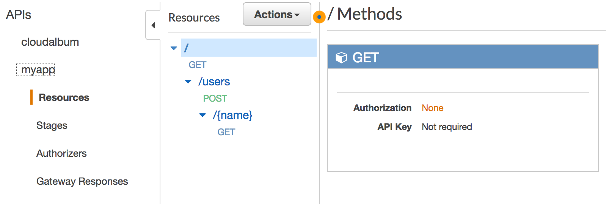
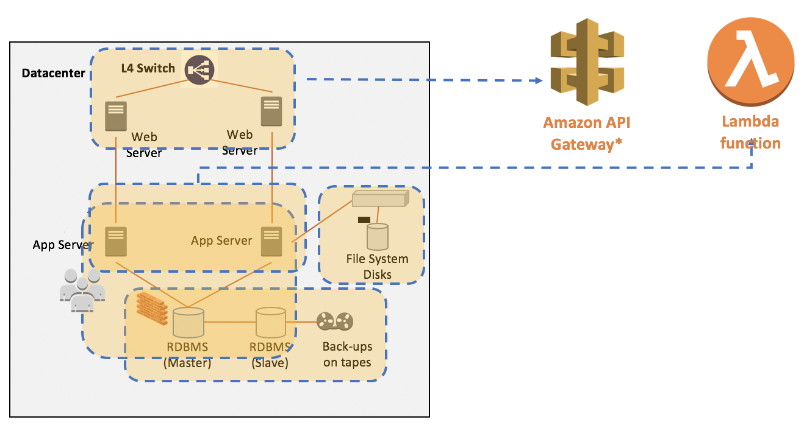
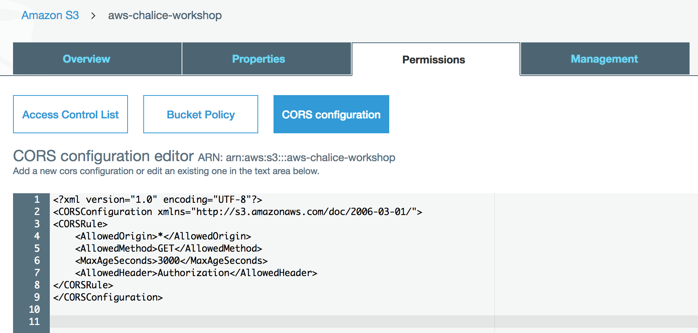
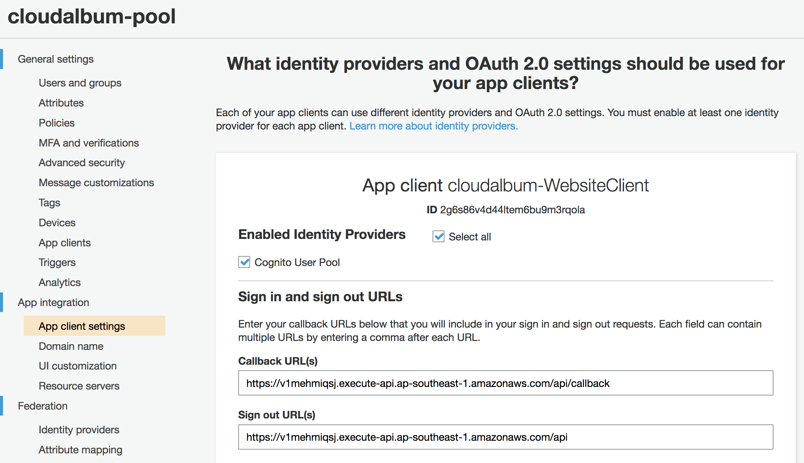
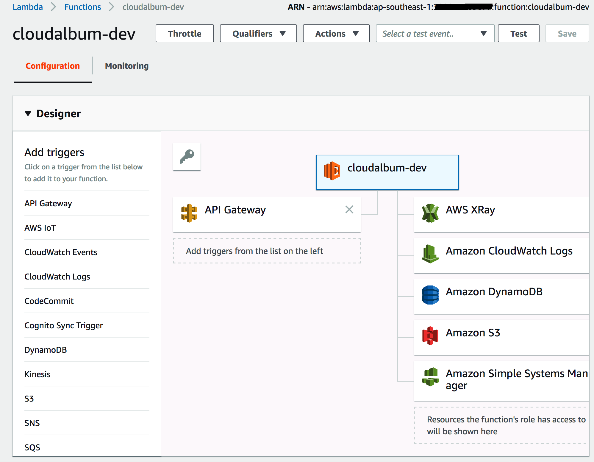
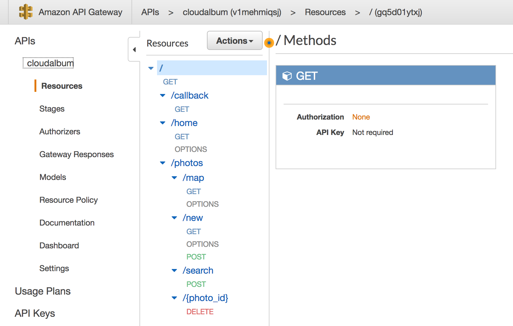

# LAB 03 - Serverless with AWS Chalice
This exercise is divided into two parts. The first part is about the AWS serverless framework Chalice, and the second part is using the Chalice to run the CloudAlbum application.

## Serverless framework
There are various serverless frameworks. Here is a brief introduction to each of the serverless frameworks.

### AWS Chalice
`Chalice` is a microframework(https://github.com/aws/chalice) for writing serverless apps in python. It makes it simple for you to use AWS Lambda and Amazon API Gateway to build serverless apps. It allows you to quickly create and deploy applications that use AWS Lambda. It provides:

* A command line tool for creating, deploying, and managing your app
* A decorator based API for integrating with Amazon API Gateway, Amazon S3, Amazon SNS, Amazon SQS, and other AWS services.
* Automatic IAM policy generation

### Serverless 
The `Serverless` Framework (https://serverless.com) is an MIT open source framework that’s actively developed and maintained by a full-time team. At its essence, it allows users to define a serverless application—including Lambda functions and API Gateway APIs—and then deploy it using a command-line interface (CLI). It helps you organize and structure serverless applications, which is of great benefit as you begin to build larger systems, and it’s fully extensible via its plugin system.

### Zappa
`Zappa` (https://github.com/Miserlou/Zappa) makes it super easy to build and deploy server-less, event-driven Python applications (including, but not limited to, WSGI web apps) on AWS Lambda + API Gateway. Think of it as "serverless" web hosting for your Python apps. That means infinite scaling, zero downtime, zero maintenance - and at a fraction of the cost of your current deployments!

**NOTE:** These `serverless frameworks` have many similarities. You can choose one framework from the above. In this hands-on lab, **you will use AWS Chalice**.

## TASK 1 : Build a simple AWS Chalice serverless app.
This TASK will provide an introduction on how to use AWS Chalice and provide instructions on how to go about building your very first Chalice application. 

1. To start using Chalice, you will need to install Chalice python package.

```
sudo pip-3.6 install chalice
```

2. To check that chalice was installed, run:
```
chalice --version
chalice 1.3.0
```

3. Now AWS Chalice serverless framework installed, it is time to create your first Chalice application. Run the `chalice new-project` command to create a project called `myapp`:

```
mkdir -p ~/environment/aws-chalice-migration-workshop/LAB03/01-Chalice/
cd ~/environment/aws-chalice-migration-workshop/LAB03/01-Chalice/
chalice new-project myapp
```

4. Review the generated files which generated by Chalice framework.
```
sudo yum install tree
tree -a .
<username>:~/environment/aws-chalice-migration-workshop/LAB03/01-Chalice (master) $ tree -a .
.
└── myapp
    ├── app.py
    ├── .chalice
    │   └── config.json
    ├── .gitignore
    └── requirements.txt

```
* You can find above files after run `chalice new-project myapp` command. 

```
cd myapp
vi app.py (or use open int the Cloud9 default editor)
```
```python
from chalice import Chalice

app = Chalice(app_name='myapp')


@app.route('/')
def index():
    return {'hello': 'world'}

```
* It looks very similar to the **Flask** framework. 

5. Run Chalice application as a local application in your machine.
```
chalice local --port 8080
```
You can see the following message: `Serving on 127.0.0.1:8080`
if you want detailed execution information, you can run Chalice as debug mode `chalice --debug local`

For the convenience of test, we will use `httpie` in the shell. 

* You can open new terminal with bash shell and then type following command.

```console
$ sudo pip install httpie
```

* After `httpie` is installed, you can run following command for the application test.
```
$ http localhost:8080/
```
* output:
```
HTTP/1.1 200 OK
Content-Length: 18
Content-Type: application/json
Date: Sun, 05 Aug 2018 07:02:01 GMT
Server: BaseHTTP/0.6 Python/3.6.5

{
    "hello": "world"
}

```

6. To help your understanding, consider the following example.
```python
from chalice import Chalice
from chalice import Response 
import logging

app = Chalice(app_name='myapp')
app.debug = True
app.log.setLevel(logging.DEBUG)


@app.route('/')
def index():
    return {'hello': 'world'}


@app.route('/users/{name}', methods=['GET'])
def user_info(name):
    request=app.current_request
    app.log.debug(request.method)
    app.log.debug(request.to_dict())
    body='<h1> Your name is {0}.</h1>'.format(name)

    return Response(body=body,
        status_code=200,
        headers={'Content-Type': 'text/html; charset=utf-8'})


@app.route('/users', methods=['POST'])
def user_add():
    request = app.current_request
    app.log.debug(request.method)
    app.log.debug(request.to_dict())

    return Response(body=request.json_body,
        status_code=200,
        headers={'Content-Type': 'application/json; charset=utf-8'})
```

* Review above code for new `app.py`. `Response` and `logging` are importted from top of the `app.py` file. Debug option is enabled for the application logging. `user_info` and `user_add` functions are added.

* Replace `app.py` file with the contents of above source code.
  * `app.py` file is located in `~/environment/aws-chalice-migration-workshop/LAB03/01-Chalice/myapp/app.py`

7. Run the new version of `myapp`.
```
chalice local --port 8080
```

8. Test new Chalice application. For the convenience, you can open additional terminal in the Cloud9 environment. 


* Test #1: `@app.route('/users/{name}', methods=['GET'])`
```
$ http localhost:8080/users/David
HTTP/1.1 200 OK
Content-Length: 29
Content-Type: text/html; charset=utf-8
Date: Sun, 05 Aug 2018 08:19:38 GMT
Server: BaseHTTP/0.6 Python/3.6.5

<h1> Your name is David.</h1>

```
* Debug log for this request (You can find it :

```
myapp - DEBUG - GET
myapp - DEBUG - {'query_params': None, 'headers': {'host': 'localhost:8080', 'user-agent': 'HTTPie/0.9.9', 'accept-encoding': 'gzip, deflate', 'accept': '*/*', 'connection': 'keep-alive'}, 'uri_params': {'name': 'David'}, 'method': 'GET', 'context': {'httpMethod': 'GET', 'resourcePath': '/users/{name}', 'identity': {'sourceIp': '127.0.0.1'}, 'path': '/users/David'}, 'stage_vars': {}}
127.0.0.1 - - [05/Aug/2018 08:19:38] "GET /users/David HTTP/1.1" 200 -

```

* Test #2: `@app.route('/users', methods=['POST'])`
```
$ echo '{"name": "David", "age": 22, "job": "student"}' | http localhost:8080/users
HTTP/1.1 200 OK
Content-Length: 46
Content-Type: application/json; charset=utf-8
Date: Sun, 05 Aug 2018 08:26:13 GMT
Server: BaseHTTP/0.6 Python/3.6.5

{
    "age": 22,
    "job": "student",
    "name": "David"
}


```
* Debug log for this request:
```
myapp - DEBUG - POST
myapp - DEBUG - {'query_params': None, 'headers': {'host': 'localhost:8080', 'user-agent': 'HTTPie/0.9.9', 'accept-encoding': 'gzip, deflate', 'accept': 'application/json, */*', 'connection': 'keep-alive', 'content-type': 'application/json', 'content-length': '48'}, 'uri_params': {}, 'method': 'POST', 'context': {'httpMethod': 'POST', 'resourcePath': '/users', 'identity': {'sourceIp': '127.0.0.1'}, 'path': '/users'}, 'stage_vars': {}}
127.0.0.1 - - [05/Aug/2018 08:26:13] "POST /users HTTP/1.1" 200 -

```

10. Deploy to API Gateway and Lambda. You can deploy this application using Chalice CLI command.
```
chalice deploy
```
* However, you will be failed with following messages.

```
Creating deployment package.
Updating policy for IAM role: myapp-dev
Traceback (most recent call last):

  (......)

botocore.exceptions.ClientError: An error occurred (InvalidClientTokenId) when calling the PutRolePolicy operation: The security token included in the request is invalid

During handling of the above exception, another exception occurred:

Traceback (most recent call last):

  (......)

chalice.deploy.deployer.ChaliceDeploymentError: ERROR - While deploying your chalice application, received the following error:

 An error occurred (InvalidClientTokenId) when calling the PutRolePolicy 
 operation: The security token included in the request is invalid

```

* The default Cloud9 working environment configure temporary 'shared-credentials-file' type crendentials. Details are in the Cloud9 document. (https://docs.aws.amazon.com/ko_kr/cloud9/latest/user-guide/credentials.html#credentials-temporary)

* For the convenience deploy, configure your credential environment variables with enough permissions rights. (such as admin access right credential)
```
export AWS_ACCESS_KEY_ID=
export AWS_SECRET_ACCESS_KEY=
```

* Run `chalice deploy` again.
```
chalice deploy
Creating deployment package.
Updating policy for IAM role: myapp-dev
Creating lambda function: myapp-dev
Creating Rest API
Resources deployed:
  - Lambda ARN: arn:aws:lambda:ap-southeast-1:1234567890:function:myapp-dev
  - Rest API URL: https://aavvueq9we.execute-api.ap-southeast-1.amazonaws.com/api/
```  
* You can get api URL easily using below command.
```
chalice url
https://aavvueq9we.execute-api.ap-southeast-1.amazonaws.com/api/
```

* Test your first Chalice application. You can refer to `step 8`.

* You can check the files of `deplyed` and `deployments` directories.
```
<username>:~/environment/aws-chalice-migration-workshop/LAB03/01-Chalice (master) $ tree -a .
.
└── myapp
    ├── app.py
    ├── .chalice
    │   ├── config.json
    │   ├── deployed
    │   │   └── dev.json
    │   └── deployments
    │       └── d41d8cd98f00b204e9800998ecf8427e-python3.6.zip
    ├── .gitignore
    ├── __pycache__
    │   └── app.cpython-36.pyc
    └── requirements.txt
5 directories, 7 files
```

11. Examine your **API Gateway** and **Lambda** Console. You can see the new API and Lambda functions.
* API Gateway console (myapp)


* Lambda console (myapp-dev)


12. Delete deployed application
```
<username>:~/environment/aws-chalice-migration-workshop/LAB03/01-Chalice/myapp (master) $ chalice delete
Deleting Rest API: w2t3ueq9we
Deleting function: arn:aws:lambda:ap-southeast-1:1234567890:function:myapp-dev
Deleting IAM role: myapp-dev
```

* If it works well, let's go to next TASK!

## TASK 2 : CloudAlbum with AWS Chalice
We have removed server based components via LAB02. We are now going serverless by removing Web Server Tier and App Server Tier.



Finally, all servers are gone!


13. Let's take a look around `LAB03/02-CloudAlbum-Chalice/` directory.

```
$ cd ~/environment/aws-chalice-migration-workshop/LAB03/02-CloudAlbum-Chalice/cloudalbum/

$ tree -L 2 -a .
├── app.py
├── .chalice
│   └── config.json
├── chalicelib
│   ├── config.py
│   ├── __init__.py
│   ├── models_ddb.py
│   ├── templates
│   └── util.py
├── .gitignore
├── requirements.txt
└── vendor
    ├── bin
    ├── jinja2
    ├── Jinja2-2.10.dist-info
    ├── markupsafe
    ├── pyasn1
    ├── pyasn1-0.4.3.dist-info
    ├── python_jose-3.0.0.dist-info
    ├── rsa
    └── rsa-3.4.2.dist-info

```

* All of route functions are in the `app.py` and `template` and modules are in the `chalicelib` directory.

**3rd Party Packages:** 
There are two options for handling python package dependencies:

* `requirements.txt` - During the packaging process, Chalice will install any packages it finds or can build compatible wheels for. Specifically all pure python packages as well as all packages that upload wheel files for the `manylinux1_x86_64` platform will be automatically installable.

* `vendor/` - The contents of this directory are automatically added to the top level of the deployment package. Chalice will also check for an optional `vendor/` directory in the project root directory. The contents of this directory are automatically included in the top level of the deployment.

* Chalice will also check for an optional `vendor/` directory in the project root directory. The contents of this directory are automatically included in the top level of the deployment package (see Examples for specific examples). The `vendor/` directory is helpful in these scenarios:

* You need to include custom packages or binary content that is not accessible via pip. These may be internal packages that aren’t public.

* `Wheel files` are not available for a package you need from pip.

* A package is installable with requirements.txt but has optional c extensions. Chalice can build the dependency without the c extensions, but if you want better performance you can vendor a version that is compiled.

* As a general rule of thumb, code that you write goes in either `app.py` or `chalicelib/`, and dependencies are
either specified in `requirements.txt` or placed in the `vendor/` directory.

14. Examine `.py` files. Flask dependecies are removed. Only Jinja2 package is alived in the `vendor` directory. 


15. Set up application parameters. We will user `Parameter Store` (https://docs.aws.amazon.com/systems-manager/latest/userguide/systems-manager-paramstore.html) for the application configuration.

* **NOTE:** Please make sure replace `<...>` values your **OWN VALUE**.
  * https://docs.aws.amazon.com/systems-manager/latest/userguide/sysman-paramstore-cli.html 

```console

aws ssm put-parameter --name "/cloudalbum/GMAPS_KEY" --value "<GMAPS_KEY>" --type "SecureString"
aws ssm put-parameter --name "/cloudalbum/THUMBNAIL_WIDTH" --value "300" --type "SecureString"
aws ssm put-parameter --name "/cloudalbum/THUMBNAIL_HEIGHT" --value "200" --type "SecureString"

aws ssm put-parameter --name "/cloudalbum/AWS_REGION" --value "<AWS_REGION>" --type "SecureString"
aws ssm put-parameter --name "/cloudalbum/DDB_RCU" --value "10" --type "SecureString"
aws ssm put-parameter --name "/cloudalbum/DDB_WCU" --value "10" --type "SecureString"

aws ssm put-parameter --name "/cloudalbum/S3_PHOTO_BUCKET" --value "<S3_PHOTO_BUCKET>" --type "SecureString"

aws ssm put-parameter --name "/cloudalbum/COGNITO_POOL_ID" --value "<COGNITO_POOL_ID>" --type "SecureString"
aws ssm put-parameter --name "/cloudalbum/COGNITO_CLIENT_ID" --value "<COGNITO_CLIENT_ID>" --type "SecureString"
aws ssm put-parameter --name "/cloudalbum/COGNITO_CLIENT_SECRET" --value "<COGNITO_CLIENT_SECRET>" --type "SecureString"
aws ssm put-parameter --name "/cloudalbum/COGNITO_DOMAIN" --value "<COGNITO_DOMAIN>" --type "SecureString"

## <BASE_URL> value will be replaced real thing.(after deploy)
aws ssm put-parameter --name "/cloudalbum/BASE_URL" --value "<BASE_URL>" --type "SecureString"
```

* Verify your parameters. 

```console
aws ssm describe-parameters
{
    "Parameters": [
        {
            "Name": "/cloudalbum/AWS_REGION",
            "Type": "SecureString",
            "KeyId": "alias/aws/ssm",
            "LastModifiedDate": 1533589218.29,
            "LastModifiedUser": "arn:aws:iam::1234567890:user/poweruser",
            "Version": 1
        },
        {
            "Name": "/cloudalbum/BASE_URL",
            "Type": "SecureString",
            "KeyId": "alias/aws/ssm",
            "LastModifiedDate": 1533589322.314,
            "LastModifiedUser": "arn:aws:iam::1234567890:user/poweruser",
            "Version": 1
        },
        {
            "Name": "/cloudalbum/COGNITO_CLIENT_ID",
            "Type": "SecureString",
            "KeyId": "alias/aws/ssm",
            "LastModifiedDate": 1533589258.2,
            "LastModifiedUser": "arn:aws:iam::1234567890:user/poweruser",
            "Version": 1
        },
        {

            (...........)

        }
}
```

```console
aws ssm get-parameters --names "/cloudalbum/DDB_RCU" --with-decryption
{
    "Parameters": [
        {
            "Name": "/cloudalbum/DDB_RCU",
            "Type": "SecureString",
            "Value": "10",
            "Version": 1,
            "LastModifiedDate": 1533589224.013,
            "ARN": "arn:aws:ssm:ap-southeast-1:1234567890:parameter/cloudalbum/DDB_RCU"
        }
    ],
    "InvalidParameters": []
}
```


16. Review `config.py` file located in 'LAB03/02-CloudAlbum-Chalice/cloudalbum/chalicelib/config.py'.

```python
from chalice import CORSConfig
import boto3


def get_param(param_name):
    """
    This function reads a secure parameter from AWS' SSM service.
    The request must be passed a valid parameter name, as well as
    temporary credentials which can be used to access the parameter.
    The parameter's value is returned.
    """
    # Create the SSM Client
    ssm = boto3.client('ssm')

    # Get the requested parameter
    response = ssm.get_parameters(
        Names=[param_name, ], WithDecryption=True
    )

    # Store the credentials in a variable
    result = response['Parameters'][0]['Value']

    return result


conf = {
    # Mandatory variable
    'GMAPS_KEY': get_param('/cloudalbum/GMAPS_KEY'),

    # Default config values
    'THUMBNAIL_WIDTH': get_param('/cloudalbum/THUMBNAIL_WIDTH'),
    'THUMBNAIL_HEIGHT': get_param('/cloudalbum/THUMBNAIL_HEIGHT'),

    # DynamoDB
    'AWS_REGION': get_param('/cloudalbum/AWS_REGION'),
    'DDB_RCU': get_param('/cloudalbum/DDB_RCU'),
    'DDB_WCU': get_param('/cloudalbum/DDB_WCU'),

    # S3
    'S3_PHOTO_BUCKET': get_param('/cloudalbum/S3_PHOTO_BUCKET'),

    # COGNITO
    'COGNITO_POOL_ID': get_param('/cloudalbum/COGNITO_POOL_ID'),
    'COGNITO_CLIENT_ID': get_param('/cloudalbum/COGNITO_CLIENT_ID'),
    'COGNITO_CLIENT_SECRET': get_param('/cloudalbum/COGNITO_CLIENT_SECRET'),
    'COGNITO_DOMAIN': get_param('/cloudalbum/COGNITO_DOMAIN'),
    'BASE_URL': "https://{0}".format(get_param('/cloudalbum/BASE_URL'))
}


S3_STATIC_URL = "https://s3-{0}.amazonaws.com/{1}/static".format(conf['AWS_REGION'], conf['S3_PHOTO_BUCKET'])

cors_config = CORSConfig(
    allow_origin='*',
    allow_headers=['X-Special-Header'],
    max_age=600,
    expose_headers=['X-Special-Header'],
    allow_credentials=True
)

```


17. Review the `get_param` function in the `config.py` file.

```python
def get_param(param_name):
    """
    This function reads a secure parameter from AWS' SSM service.
    The request must be passed a valid parameter name, as well as
    temporary credentials which can be used to access the parameter.
    The parameter's value is returned.
    """
    # Create the SSM Client
    ssm = boto3.client('ssm')

    # Get the requested parameter
    response = ssm.get_parameters(
        Names=[param_name, ], WithDecryption=True
    )

    # Store the credentials in a variable
    result = response['Parameters'][0]['Value']

    return result
```


18. Copy static files to your S3 Bucket.
```
$ cd ~/environment/aws-chalice-migration-workshop/LAB03/
$ mkdir -p temp
$ cd temp
$ wget https://d2r3btx883i63b.cloudfront.net/workshop/static_files.zip
$ unzip static_files.zip
$ aws s3 sync static/ s3://<Your bucket S3_PHOTO_BUCKET>/static/ --acl public-read
```


aws s3 sync static/ s3://cloudalbum-chungho/static/ —acl public-read

19. Enable S3 bucket CORS configuration in your S3 Console. (https://docs.aws.amazon.com/AmazonS3/latest/dev/cors.html)


```xml
<?xml version="1.0" encoding="UTF-8"?>
<CORSConfiguration xmlns="http://s3.amazonaws.com/doc/2006-03-01/">
<CORSRule>
    <AllowedOrigin>*</AllowedOrigin>
    <AllowedMethod>GET</AllowedMethod>
    <MaxAgeSeconds>3000</MaxAgeSeconds>
    <AllowedHeader>Authorization</AllowedHeader>
</CORSRule>
</CORSConfiguration>

```

20. Review template files. Template files which stored `chalicelib/templates` are already changed to load static resources in your S3 bucket. You can refer above variable in the config.py file.
```python
S3_STATIC_URL = "https://s3-{0}.amazonaws.com/{1}/static".format(conf['AWS_REGION'], conf['S3_PHOTO_BUCKET'])
```


21. Review the `app.py` in the 'LAB03/02-CloudAlbum-Chalice/cloudalbum/app.py' 
* Flask dependencies removed
  * Flask, url_for, flash, flask_login and so on.
* Chalice has similar features like flask route decorator structure.
* CloudAlbum is not restful, it is still **tightly coupled with Jinja2 template engine**. So, we use Jinja2 template engine in this time.
* Chalice permmited to load python modules **from the `chalicelib` directory**. We will use this directory which contains `templates` directory. You can refer to following code in `LAB03/02-CloudAlbum-Chalice/cloudalbum/app.py`. 
```python
env = Environment(
    loader=PackageLoader(__name__, 'chalicelib/templates'),
    autoescape=select_autoescape(['html', 'xml']))
```

* We can use Jinja2 template engine like below:

```python
t = env.get_template('upload.html')
body = t.render(current_user=user, gmaps_key=conf['GMAPS_KEY'], s3_static_url=S3_STATIC_URL)
```

**NOTE:** `static` contents will be moved S3, so we need to copy static files in your S3 bucket. Jinja2 Template engine will load template in the `chalicelib/templates` directory.

**NOTE:** Please set `GMAPS_KEY` variable before you run.


22. Generate application execution policy before run. Review following policy.
```JSON
{
    "Version": "2012-10-17",
    "Statement": [
        {
            "Sid": "VisualEditor0",
            "Effect": "Allow",
            "Action": [
                "s3:*",
                "logs:*",
                "ssm:*",
                "dynamodb:*",
                "xray:*"
            ],
            "Resource": "*"
        }
    ]
}
```

* **NOTE:** As you know, this policy is just example for the convinience not for practical environment. 

* This policy is provided for the workshop as `policy-dev.json` in the `LAB03/02-CloudAlbum-Chalice/cloudalbum/.chalice/policy-dev.json`. 


* Whenever your application is deployed using chalice, the **auto generated policy** is written to disk at <projectdir>/.chalice/policy.json. When you run the chalice deploy command, you can also specify the --no-autogen-policy option. Doing so will result in the chalice CLI loading the <projectdir>/.chalice/policy.json file and using that file as the policy for the IAM role. You can manually edit this file and **specify --no-autogen-policy** if you'd like to have full control over what IAM policy to associate with the IAM role.


23. Now, you can deploy CloudAlbum application with chalice. 
```console
chalice deploy --no-autogen-policy
Creating deployment package.
Updating policy for IAM role: cloudalbum-dev-api_handler
Updating lambda function: cloudalbum-dev
Updating rest API
Resources deployed:
  - Lambda ARN: arn:aws:lambda:ap-southeast-1:389833669077:function:cloudalbum-dev
  - Rest API URL: https://v1mehmiqsj.execute-api.ap-southeast-1.amazonaws.com/api/
```

* Keep the `Rest API URL` value and update Parameter Store using this value. You should remove `https://` and `/` (last character) like following strins.

   * v1mehmiqsj.execute-api.ap-southeast-1.amazonaws.com/api

```console
aws ssm put-parameter --name "/cloudalbum/BASE_URL" --value "v1mehmiqsj.execute-api.ap-southeast-1.amazonaws.com/api" --type "SecureString"
```


24. Configure `App client cloudalbum` in the **Cognito console.**


* Update `Callback URL(s)`.
* Update `Sign out URL(s)`.

25. Look into your **Lambda Console.**



26. Look into your **API Gateway Console.**



27. Connect to your application through API Gateway. open `https://v1mehmiqsj.execute-api.ap-southeast-1.amazonaws.com/api` in your browser. 
* If you missed API Gateway **URL**, you can use `chalice url` command.


28. Perform application test.


* Sign in / up
* Upload Sample Photos
* Sample images download here 
  *  https://d2r3btx883i63b.cloudfront.net/temp/sample-photo.zip
* Look your Album
* Change Profile
* Find photos with Search tool
* Check the Photo Map

## Go further

## Congratulation! You completed LAB03.